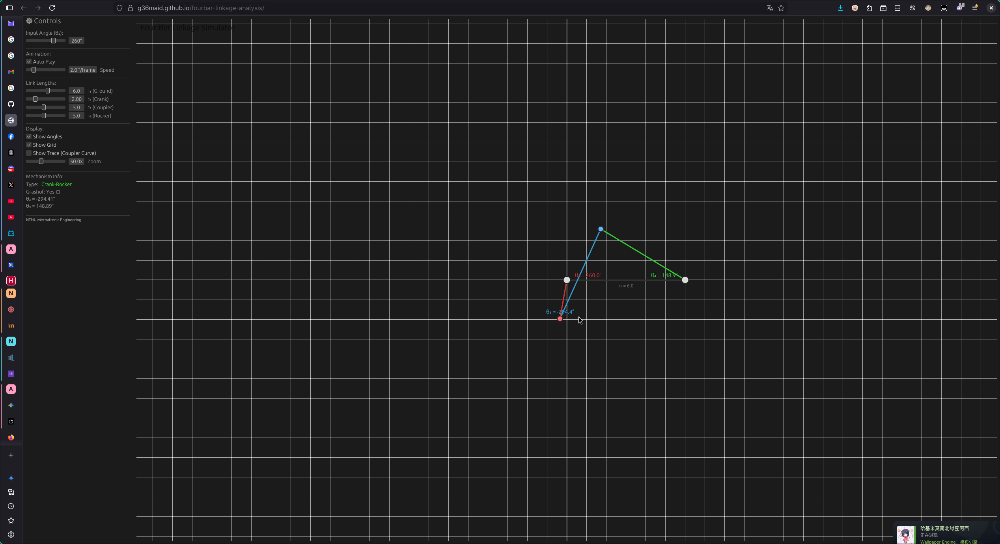

# Four-Bar Linkage Analysis

[](https://github.com/g36maid/fourbar-linkage-analysis/actions/workflows/deploy.yml)
[](https://opensource.org/licenses/MIT)
[](https://www.rust-lang.org/)
[](https://www.python.org/)

Interactive simulation and numerical analysis of four-bar linkages using Newton-Raphson method.
結合 Rust 互動模擬與 Python 數值分析的機構學專案。

---

### 🚀 **[Live Demo (線上模擬器)](https://g36maid.github.io/fourbar-linkage-analysis/)**
**無須安裝，直接在瀏覽器中操作 (WebAssembly Powered)**



## 📄 Project Highlights

* **Interactive Simulation**: 使用 **Rust + egui** 開發的即時模擬器，支援 Web (WASM) 與 Native 執行。
* **Numerical Method**: 實作 **Newton-Raphson** 方法求解非線性向量迴路方程式。
* **Visualization**: 提供 Python 腳本生成高品質學術圖表 (Matplotlib)。
* **CI/CD**: 自動化測試並部署至 GitHub Pages。

## 📥 Resources

* **[📄 技術報告 (PDF Report)](docs/report.pdf)**
* **[📊 線上模擬器](https://g36maid.github.io/fourbar-linkage-analysis/)**

## 🛠️ Quick Start

**Local Development (Rust):**
```bash
git clone [https://github.com/g36maid/fourbar-linkage-analysis.git](https://github.com/g36maid/fourbar-linkage-analysis.git)
cd fourbar-linkage-analysis
./run.sh rust  # Run Native GUI
```
## 📚 References

1. Norton, R. L. (2019). *Design of Machinery*. McGraw-Hill Education.
2. Course Lecture Notes: Ch4-Ch5 - Linkage Analysis Methods
3. [Four-bar linkage - Wikipedia](https://en.wikipedia.org/wiki/Four-bar_linkage)
4. [Newton-Raphson Method](https://en.wikipedia.org/wiki/Newton%27s_method)
5. [Grashof Condition](https://en.wikipedia.org/wiki/Grashof_condition)
6. [egui Documentation](https://docs.rs/egui/)

---

## 👤 Author

**鍾詠傑**  
學號：41173058h  
國立臺灣師範大學 機電工程學系

---

*Last Updated: December 2025*
