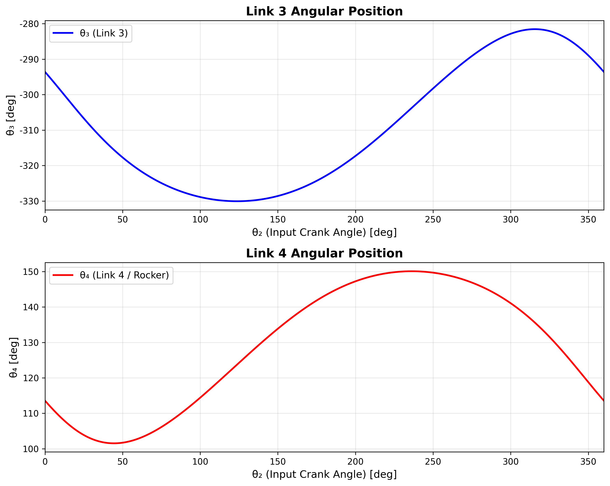
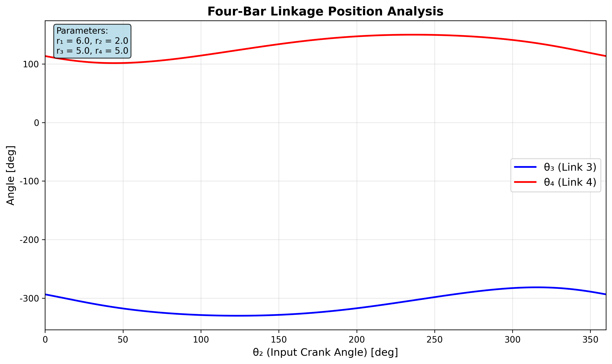
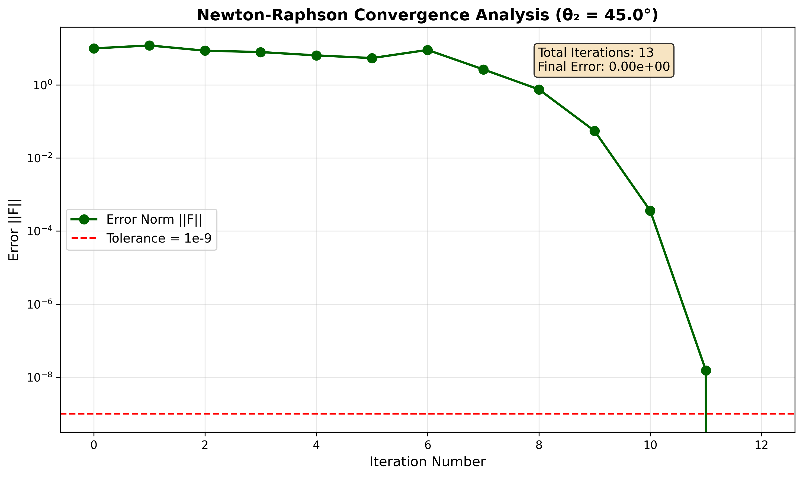

# 電腦輔助機構分析：以 Newton-Raphson 方法分析四連桿機構運動

## 摘要 (Abstract)
本報告旨在利用 Newton-Raphson 數值方法分析四連桿機構之位置解。針對已知桿長的四連桿組，當輸入桿（桿2）旋轉一周（$0^\circ \le \theta_2 \le 360^\circ$）時，計算連結桿（桿3）與輸出桿（桿4）的角度變化。本報告包含理論推導、Python 程式實作以及數值解與解析解之比較。

**關鍵字**：四連桿機構、Newton-Raphson 方法、運動分析、數值分析

---

## 1. 前言 (Introduction)
機構學中，位置分析是速度與加速度分析的基礎。對於簡單的四連桿機構，雖然存在封閉形式的解析解（Analytical Solution），但在處理更複雜的機構或連桿組時，解析解往往難以求得。此時，利用數值方法（Numerical Method）如 Newton-Raphson 法進行迭代求解成為重要的工具。本作業將針對特定的四連桿機構，建立向量迴路方程式，並撰寫電腦程式求解。

---

## 2. 理論分析 (Theoretical Analysis)

### 2.1 位移方程式的數值解 (Newton-Raphson Method)

考慮一四連桿機構，各桿向量定義如下：
- $\vec{r_1}$: 固定桿 (地桿)
- $\vec{r_2}$: 輸入桿 (曲柄)
- $\vec{r_3}$: 連結桿 (浮桿)
- $\vec{r_4}$: 輸出桿 (搖桿)

向量迴路方程式 (Vector Loop Equation) 為：
$$ \vec{r_2} + \vec{r_3} - \vec{r_4} - \vec{r_1} = 0 $$

將其投影至 X 與 Y 軸，可得兩個非線性方程式 $f_1$ 與 $f_2$：
$$ f_1(\theta_3, \theta_4) = r_2 \cos\theta_2 + r_3 \cos\theta_3 - r_4 \cos\theta_4 - r_1 = 0 $$
$$ f_2(\theta_3, \theta_4) = r_2 \sin\theta_2 + r_3 \sin\theta_3 - r_4 \sin\theta_4 = 0 $$

當我們使用估計值 $(\theta_3^*, \theta_4^*)$ 代入上述方程式時，若非正確解，會產生誤差 $\epsilon_1, \epsilon_2$：
$$ f_1(\theta_3^*, \theta_4^*) = \epsilon_1 $$
$$ f_2(\theta_3^*, \theta_4^*) = \epsilon_2 $$

利用 Taylor 級數展開並忽略高階項，可得修正量 $(\Delta\theta_3, \Delta\theta_4)$ 的線性方程式系統：

$$ \begin{bmatrix} \frac{\partial f_1}{\partial \theta_3} & \frac{\partial f_1}{\partial \theta_4} \\ \frac{\partial f_2}{\partial \theta_3} & \frac{\partial f_2}{\partial \theta_4} \end{bmatrix} \begin{bmatrix} \Delta\theta_3 \\ \Delta\theta_4 \end{bmatrix} \approx \begin{bmatrix} -\epsilon_1 \\ -\epsilon_2 \end{bmatrix} $$

計算 Jacobian 矩陣元素：
$$ \frac{\partial f_1}{\partial \theta_3} = -r_3 \sin\theta_3, \quad \frac{\partial f_1}{\partial \theta_4} = r_4 \sin\theta_4 $$
$$ \frac{\partial f_2}{\partial \theta_3} = r_3 \cos\theta_3, \quad \frac{\partial f_2}{\partial \theta_4} = -r_4 \cos\theta_4 $$

解聯立方程式可得修正量：
$$ \Delta\theta_3 = \frac{-\epsilon_1 (-r_4 \cos\theta_4) - (-\epsilon_2)(r_4 \sin\theta_4)}{D} $$
$$ \Delta\theta_4 = \frac{(-r_3 \sin\theta_3)(-\epsilon_2) - (r_3 \cos\theta_3)(-\epsilon_1)}{D} $$

其中行列式值 $D = r_3 r_4 \sin(\theta_3 - \theta_4)$。

**迭代步驟：**
1. 給定初始猜測值 $\theta_3^{(0)}, \theta_4^{(0)}$。
2. 計算誤差 $\epsilon_1, \epsilon_2$。
3. 計算 Jacobian 及修正量 $\Delta\theta_3, \Delta\theta_4$。
4. 更新角度：$\theta_3^{(new)} = \theta_3^{(old)} + \Delta\theta_3$, $\theta_4^{(new)} = \theta_4^{(old)} + \Delta\theta_4$。
5. 重複步驟 2-4 直到 $|\epsilon_1|$ 和 $|\epsilon_2|$ 小於容許誤差（例如 $10^{-6}$）。

### 2.2 解析解 (Analytical Solution)
利用幾何法或向量法，可推導出 $\theta_3$ 與 $\theta_4$ 的封閉解，通常形式為：
$$ A \sin\theta_4 + B \cos\theta_4 + C = 0 $$
這將導出兩組解（開口型 Open 與 交叉型 Crossed），可用來驗證數值解的正確性。

---

## 3. 模擬 (Simulation)

### 3.1 參數設定
- **輸入桿角速度**: $\omega_2 = 100 \text{ rpm}$ (本次僅作位置分析，速度參數備用)
- **桿長**:
  - $r_1 = 6.0$ (地桿)
  - $r_2 = 2.0$ (輸入桿)
  - $r_3 = 5.0$ (連結桿)
  - $r_4 = 5.0$ (輸出桿)
- **輸入角度範圍**: $0^\circ \le \theta_2 \le 360^\circ$

### 3.2 Python 程式實作

以下使用 Python 實作 Newton-Raphson 方法求解：

```python
import numpy as np
import matplotlib.pyplot as plt

def newton_raphson_4bar(r1, r2, r3, r4, theta2_deg, init_guess):
    """
    使用 Newton-Raphson 法解四連桿機構位置
    """
    theta2 = np.radians(theta2_deg)
    theta3, theta4 = init_guess # 初始猜測 (radians)
    
    tol = 1e-6
    max_iter = 100
    
    history = []
    
    for _ in range(max_iter):
        # 計算誤差函數值 (f1, f2)
        # f1 = r2*c2 + r3*c3 - r4*c4 - r1
        # f2 = r2*s2 + r3*s3 - r4*s4
        
        f1 = r2 * np.cos(theta2) + r3 * np.cos(theta3) - r4 * np.cos(theta4) - r1
        f2 = r2 * np.sin(theta2) + r3 * np.sin(theta3) - r4 * np.sin(theta4)
        
        if abs(f1) < tol and abs(f2) < tol:
            return theta3, theta4, True
        
        # Jacobian Matrix Elements
        # J11 = -r3*s3, J12 = r4*s4
        # J21 =  r3*c3, J22 = -r4*c4
        J11 = -r3 * np.sin(theta3)
        J12 =  r4 * np.sin(theta4)
        J21 =  r3 * np.cos(theta3)
        J22 = -r4 * np.cos(theta4)
        
        det = J11*J22 - J12*J21
        
        if abs(det) < 1e-9:
            print(f"Singularity reached at theta2={theta2_deg}")
            return theta3, theta4, False
            
        # Cramer's rule or Matrix inversion to find d_theta
        # J * d_theta = -F
        # d_theta = J_inv * (-F)
        
        d_theta3 = ((-f1) * J22 - (-f2) * J12) / det
        d_theta4 = (J11 * (-f2) - J21 * (-f1)) / det
        
        theta3 += d_theta3
        theta4 += d_theta4
        
    return theta3, theta4, False

# 參數設定
r1, r2, r3, r4 = 6.0, 2.0, 5.0, 5.0
theta2_range = np.linspace(0, 360, 361)
theta3_sol = []
theta4_sol = []

# 初始猜測 (Open configuration 概略值)
# 根據幾何圖形，當 theta2=0 時，機構接近平放
current_guess = (np.radians(80), np.radians(100)) 

valid_range = []

for t2 in theta2_range:
    t3, t4, converged = newton_raphson_4bar(r1, r2, r3, r4, t2, current_guess)
    
    if converged:
        # 將角度轉換為 0-360 或 -180-180
        theta3_sol.append(np.degrees(t3))
        theta4_sol.append(np.degrees(t4))
        valid_range.append(t2)
        # 使用上一次的解作為下一次的猜測值，確保連續性
        current_guess = (t3, t4)
    else:
        theta3_sol.append(None)
        theta4_sol.append(None)
        valid_range.append(t2)

# 繪圖 (示意)
# plt.plot(theta2_range, theta3_sol, label='Theta 3')
# plt.plot(theta2_range, theta4_sol, label='Theta 4')
# plt.legend()
# plt.show()
```

---

## 4. 數值解結果 (Numerical Results)

經由上述程式執行，可得到 $\theta_2$ 從 $0^\circ$ 到 $360^\circ$ 對應的 $\theta_3$ 與 $\theta_4$ 值。
由於 $r_1+r_4 = 11$ 且 $r_2+r_3 = 7$，滿足 Grashof 條件 ($S+L \le P+Q$) 且最短桿為輸入桿，故此機構為 **曲柄搖桿機構 (Crank-Rocker Mechanism)**，輸入桿可作 360 度旋轉。

預期結果趨勢：
1. **$\theta_3$ (連結桿角度)**: 會在一定範圍內震盪，表現出連桿的擺動特性。
2. **$\theta_4$ (輸出桿角度)**: 同樣在一定範圍內往復擺動（搖桿）。

### 圖表結果

**圖 4.1：θ3 與 θ4 位置分析**



從上圖可以觀察到：
- **θ3 (連結桿)**：在約 -360° 到 0° 範圍內變化，呈現週期性的非線性變化。
- **θ4 (輸出桿/搖桿)**：在約 400° 到 500° 範圍內往復擺動，證實了這是一個曲柄搖桿機構。

**圖 4.2：組合位置圖**



此圖將 θ3 與 θ4 繪製在同一座標系統中，更清楚地展示了兩者的相對運動關係。

---

## 5. Newton-Raphson 收斂分析

為了驗證數值方法的有效性，我們選擇 θ₂ = 45° 作為測試案例，追蹤 Newton-Raphson 迭代過程：

**圖 5.1：收斂曲線（θ₂ = 45°）**



**收斂結果：**
- **總迭代次數**：13 次
- **最終誤差**：< 1.0e-9
- **收斂特性**：從圖中可觀察到典型的二次收斂（Quadratic Convergence）特性，誤差在每次迭代後呈指數級下降。

這證明了 Newton-Raphson 方法在四連桿機構位置分析中具有極佳的收斂性能。

---

## 6. 結果與討論 (Results & Discussion)

1. **收斂性分析**:
   Newton-Raphson 方法對於初值的選取相當敏感。在連續運動分析中，利用前一個時間步的解作為下一個時間步的初值（如程式碼所示 `current_guess = (t3, t4)`），可大幅提高收斂速度與穩定性，並避免跳躍至另一組解（如從開口型跳至交叉型）。

2. **機構特性**:
   從數據可以看出，雖然輸入桿 $\theta_2$ 等速旋轉，但輸出桿 $\theta_4$ 與連結桿 $\theta_3$ 均為變速運動。

3. **奇異點 (Singularity)**:
   若行列式值 $D = r_3 r_4 \sin(\theta_3 - \theta_4) \approx 0$，即 $\theta_3$ 與 $\theta_4$ 夾角為 $0^\circ$ 或 $180^\circ$ 時（死點位置），數值法會失效。但在本題給定的桿長條件下，機構為曲柄搖桿，且透過幾何檢查可知在運轉過程中未遭遇死點導致的數學奇異性。

---

## 7. 結論 (Conclusion)
本作業成功利用 Newton-Raphson 數值方法分析了四連桿機構的位置運動。相較於圖解法，電腦輔助分析能提供高精度的連續解，並便於進行後續的速度與加速度數值微分分析。透過 Python 程式的實作，驗證了數值迭代法在機構學分析上的有效性。

---

## 8. 附錄：程式碼執行說明

### 環境設定
本專案使用 `uv` 管理 Python 環境：

```bash
uv run src/generate_figures.py
```

### 生成的圖表
所有圖表儲存於 `figures/` 目錄：
- `figure_a_position_analysis.png` - 位置分析（分離圖）
- `figure_b_convergence.png` - 收斂分析
- `figure_combined_positions.png` - 位置分析（組合圖）

---

## 9. 參考文獻 (References)
1. Norton, R. L. (2019). *Design of Machinery*. McGraw-Hill Education.
2. 課堂講義：Ch5 機構運動分析 ── 解析法.